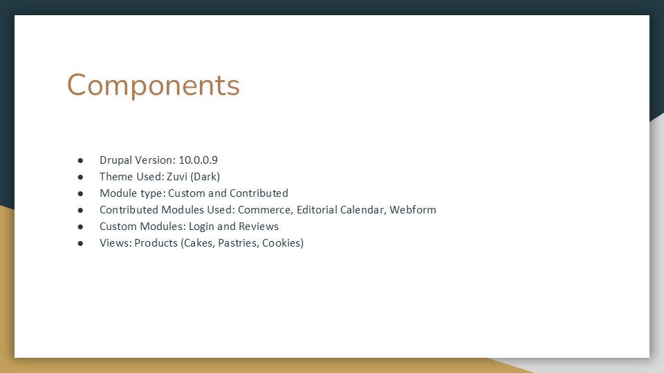

## Vienna Bakery Website (Drupal) | 2023
*Built as part of project work for Msc. (CA) - SICSR.*   

This is a bakery website built using Drupal 10. It uses the Zuvi (Dark) theme and includes both custom and contributed modules.

**Drupal Version:** 10.0.0.9  

**Theme:** Zuvi (Dark)  

**Contributed Modules:** Commerce, Editorial Calendar, Webform  

**Custom Modules:** Login, Reviews  

**Views:** Products (Cakes, Pastries, Cookies), plus some practice modules.

### Screenshots

- #### Components
  

- #### Homepage
  *Homepage showcasing featured bakery products.*
    

- #### Login
    

- #### Pastries
  *Product listing view with cakes, pastries, and cookies.*
    

- #### Cakes
    

- #### Cookies
    

- #### Shopping Cart
    

- #### Order Info
    

- #### Review Order
    

- #### Order Confirmation
    

- #### Your Review
    

- #### Custom Module Review
  

- #### About Us
    

Built with Drupal — an open-source content management platform. For more info, visit [Drupal.org](https://www.drupal.org).
